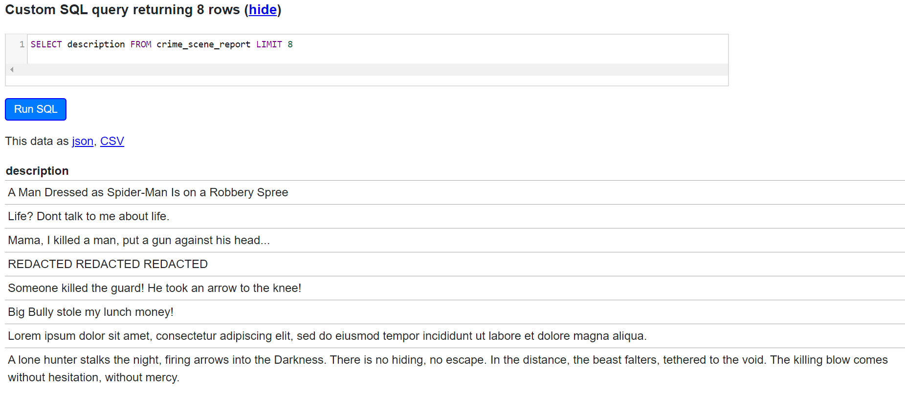

<!-- README.md is generated from README.Rmd. Please edit that file -->

```{r, include = FALSE}
knitr::opts_chunk$set(
  collapse = TRUE,
  comment = "#>",
  fig.path = "man/figures/README-",
  out.width = "100%"
)
```

# reclues

 

The __`reclues`__ package mimics the SQL Murder Mystery done by [Northwestern's Knight Lab](https://github.com/NUKnightLab/sql-mysteries) - their game is set up to use `SQL` to solve the mystery, __`reclues`__ makes their data available in __`R`__ to solve the mystery using __`R`__ ;-). 

A brief of the task at hand is given in their [walkthrough](http://mystery.knightlab.com/walkthrough.html). Want to play the SQL version of the game online? [Here it is](https://sql-murder-mystery.datasette.io/sql-murder-mystery) courtesy of Simon Willison!

# Murder Mystery Prompt (@knightlab)
## Whodunnit??
A crime has taken place and the detective needs your help. The detective gave you the crime scene report,
but you somehow lost it. You vaguely remember that the crime was a murder that occurred sometime on
__Jan.15, 2018__ and that it took place in __SQL City__.
All the clues to this mystery are buried in a huge database, and you need to use your R skills to navigate
through this vast network of information. Your first step to solving the mystery is to retrieve the corresponding
crime scene report from the police department's database. 

Take a look at the `cheatsheet` (this `Readme` file) to learn some tips on
how to do this using the tidyverse tools! From there, you can use your R skills to find the murderer.
The crime may be solved with other tools besides tidy tools, please feel free to use the dataset as a
learning tool for other packages in R or base R itself if that is your wish.
The cheatsheet is for tidyverse tools for now as a start, but since I am learning myself I may expand this to
include data.table etc. in future.
Have fun!

<!-- badges: start -->
<!-- badges: end -->

The goal of reclues is to provide the datasets from the SQL Challenge mentioned above within R, and some `cheatsheet` tidyverse commands for getting you on your way to solving the mystery.

------

## The datasets
The datasets will be available as soon as you install the package. These are the datasets available and the data contained within them.

|  Table Name|  Fields | Rows |
|:--:|:--|--:|
|  _crime_scene_report_| date, type, description, city| 1,228 rows|
|  _drivers_license_|  id, age, height, eye_color, hair_color, gender, plate_number, car_make, car_model| 10,007 rows|
|  _facebook_event_checkin_|  person_id, event_id, event_name, date| 20,011 rows|
|  _get_fit_now_check_in_|  membership_id, check_in_date, check_in_time, check_out_time| 2,703 rows|
|  _get_fit_now_member_|  id, person_id, name, membership_start_date, membership_status| 184 rows|
|  _income_|  ssn, annual_income| 7,514 rows|
|  _interview_|  person_id, transcript| 4,991 rows|
|  _person_|  id, name, license_id, address_number, address_street_name, ssn| 10,011 rows|


## Installation

You can install the development version from [GitHub](https://github.com/) with:

``` r
# install.packages("devtools")
devtools::install_github("sciencificity/reclues")
```

------
## Some useful functions to view the data

```{r view, warning=FALSE, message=FALSE}
library(reclues)
library(dplyr)
# basic example code
# see the first 6 observations
head(crime_scene_report)
glimpse(crime_scene_report)

# Notice that the type field contains info on the 
# type of crime which took place?
# Want to see how many reports of each incident type we have?
table(crime_scene_report$type)
```

## Some useful functions to explore the data

### SELECT
In R dplyr's `select()` works much the same as `SELECT` in SQL. You use it to get only specific columns you are interested in.

Let's say I wanted a closer look at the `plate_number`, `car_make` and `car_model` from the drivers_license table?

```{r select1}
# Let's have a look at a few columns of interest from
# the drivers_license table
drivers_license %>% 
  select(plate_number, car_make, car_model) %>% 
  head(3) %>% 
  # formattable func from the formattable package just prints a nice table in the Readme
  formattable::formattable()
# There are also helper functions to select columns of interest
# starts_with('start_text') will help select columns that begin with start_text
# ends_with('end_text') will help select columns that end with end_text
drivers_license %>% 
  # Maybe I am only interested in the columns describing the car...
  select(starts_with('car')) %>% 
  head(3) %>% 
  # formattable just prints a nice table in the Readme
  formattable::formattable()
```

SQL Equivalent is:

> SELECT plate_number, car_make, car_model 
> FROM drivers_license 
> LIMIT 3 

Here's a snippet from the [online SQL version](https://sql-murder-mystery.datasette.io/sql-murder-mystery):

 

------

### LIMIT
Let's say we wanted to see a part of the data - the head() function returns 6 observations and performs a similar functionality as the `LIMIT` keyword in SQL. 

* `head()` gives you the first 6 observations of the data in the "table"
* `tail()` gives you the last 6 observations of the data in the "table"

You can also specify a number as an argument to the `head()` or `tail()` functions. For example, `head(15)` and `tail(10)` will give you the first 15, and last 10 observations respectively. 

```{r limit1}
crime_scene_report %>% 
  select(description) %>% 
  head(8) %>% 
  # formattable func from the formattable package just prints a nice table in the Readme
  formattable::formattable()
```

SQL Equivalent is: 

> `SELECT description FROM crime_scene_report LIMIT 8`

Here's a snippet from the [online SQL version](https://sql-murder-mystery.datasette.io/sql-murder-mystery):    

      

Maybe I am interested in having a look at all variables associated with a person but I just want to have a look at the data not bring back all 10,011 rows.

```{r limit2}
person %>% 
  head(4) %>% 
  formattable::formattable()
```

SQL Equivalent is:

> `SELECT * FROM person LIMIT 4;`

Here's a snippet from the [online SQL version](https://sql-murder-mystery.datasette.io/sql-murder-mystery):

 

------
### DISTINCT
Let's say we wanted to see the different __types__ of criminal activity the reports identify ....    
The `type` field in the crime scene reports table seems to contain this info. We will use the `distinct` function from `dplyr`.

```{r explore, warning=FALSE, message=FALSE}
library(magrittr)

# the magrittr package contains the pipe %>% function
# Take the crime scene report data AND THEN
# give me the distinct values for the `type` variable.
crime_scene_report %>% 
    distinct(type) %>% 
    formattable::formattable()
```

SQL Equivalent is: 

> `SELECT DISTINCT(type) FROM crime_scene_report`

Here's a snippet from the [online SQL version](https://sql-murder-mystery.datasette.io/sql-murder-mystery):

 


### COUNT DISTINCT
Let's say we were wondering which city has the highest number of crimes - here we want the city and a count of the times that city is mentioned in the crime scene report ...

```{r explore2}
crime_scene_report %>% 
    count(city) %>% 
    arrange(desc(n)) %>% 
    # filter to limit the print-out
    filter(n >= 7) %>% 
    formattable::formattable()
```
Hhmmm looks like SQL City is quite notorious for crime!  

SQL Equivalent is:

> SELECT city, count(city) AS n  
> FROM crime_scene_report  
> GROUP BY city  
> ORDER BY n DESC  

Here's a snippet from the [online SQL version](https://sql-murder-mystery.datasette.io/sql-murder-mystery):

 

------
### Magnify long pieces of text
Sometimes there are fields like `crime_scene_report.description` which are hard to see because the text runs over several lines. Even using View() or printing just the description to the screen sometimes does not help. 

Enter `pull()` from the __dplyr__ package which extracts a column from the data.   

Hint: You will need something like this to read some of the textual description and transcript information.

```{r}
crime_scene_report %>% 
  head(8) %>% 
  pull(description) %>% 
  # these next 2 lines are just for displaying the result nicely in the Readme
  tibble::enframe(name = NULL) %>% 
  formattable::formattable()
```

```{r}
interview %>% 
  filter(stringr::str_length(transcript) >= 230) %>% 
  pull(transcript) %>% 
  # these next 2 lines are just for displaying the result nicely in the Readme
  tibble::enframe(name = NULL) %>% 
  formattable::formattable()
```

------
### LIKE
Let's say we're interested in finding the people that start with a __Z__. We will use the `stringr` package for this. The `str_detect()` function can be used in conjunction with regular expressions - here we looking for names that start with __`(^)`__ __Z__.

```{r like, warning=FALSE, message=FALSE}
library(stringr)
person %>% 
  filter(stringr::str_detect(name, "^Z")) %>% 
  # Limit to top 5 for the print-out
  head(5) %>% 
  formattable::formattable()
```

SQL Equivalent is:

> SELECT * FROM person  
> WHERE name LIKE 'Z%'  

Here's a snippet from the [online SQL version](https://sql-murder-mystery.datasette.io/sql-murder-mystery):

 

------
### JOINS

`dplyr` has joining functions such as `inner_join()`, `left_join()` etc. for joining one table to another. This mimics the `SQL` `INNER JOIN` etc.  
You will notice that the `person` table has a field called `id` and the `interview` table has a `person_id` field. Let's join these tables and see what we get.

```{r join}
person %>% 
  # Since the two tables have diff field names for the common field
  # we have to specify the `by` argument.
  # by = c('field_name_from_left_table' = 'field_name_from_right_table')
  inner_join(interview, by = c('id' = 'person_id')) %>% 
  # Let's say we're only interested in interviews from people who live
  # on some Drive abbreviated to 'Dr'
  filter(stringr::str_detect(address_street_name, 'Dr')) %>% 
  # Limit for print-out
  head(3) %>% 
  formattable::formattable()
```

> SELECT * FROM person    
> INNER JOIN interview ON person.id = interview.person_id  
> WHERE address_street_name LIKE '%Dr%'  
> LIMIT 3  

Here's a snippet from the [online SQL version](https://sql-murder-mystery.datasette.io/sql-murder-mystery):

 

------
# Resources for learning

## SQL

* Brandon Rohrer (@_brohrer_) has a curated list of resources [here](https://end-to-end-machine-learning.teachable.com/courses/667372/lectures/11900584)

# R

* Hadley Wickham and Garrett Grolemund's book [R for Data Science](https://r4ds.had.co.nz/)
* [dplyr cheatsheet](https://resources.rstudio.com/the-essentials-of-data-science/data-transformation)
* [dplyr video](https://resources.rstudio.com/the-essentials-of-data-science/the-grammar-and-graphics-of-data-science-58-51) and another [here](https://resources.rstudio.com/the-essentials-of-data-science/data-wrangling-with-r-and-rstudio-55-40)
* [stringr](https://stringr.tidyverse.org/articles/stringr.html)
* [Primers](https://rstudio.cloud/learn/primers)
* [RStudio Education](https://education.rstudio.com/)
* [Jumpstart with R](https://university.business-science.io/p/jumpstart-with-r)
* [Cheatsheets](https://rstudio.com/resources/cheatsheets/)
* [Loads of other resources](https://github.com/Chris-Engelhardt/data_sci_guide)


