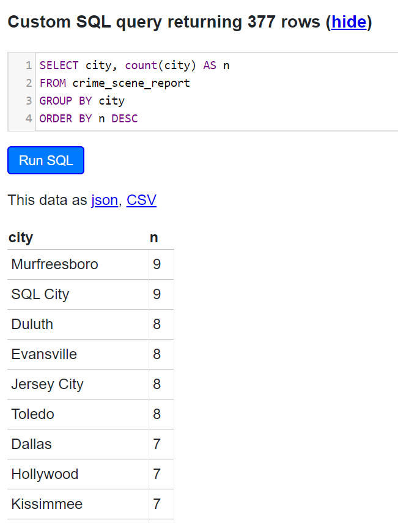

<!-- README.md is generated from README.Rmd. Please edit that file -->

# reclues

## Learn new skills while solving a mystery


The **`reclues`** package mimics the SQL Murder Mystery done by
[Northwestern’s Knight
Lab](https://github.com/NUKnightLab/sql-mysteries) - their game is set
up to use `SQL` to solve the mystery, **`reclues`** makes their data
available in **`R`** to solve the mystery using **`R`** ;-).

A brief of the task at hand is given in their
[walkthrough](http://mystery.knightlab.com/walkthrough.html). Want to
play the SQL version of the game online? [Here it
is](https://sql-murder-mystery.datasette.io/sql-murder-mystery) courtesy
of Simon Willison\!

# Getting Started: Murder Mystery Prompt (@knightlab)

## Whodunnit??

A crime has taken place and the detective needs your help. The detective
gave you the crime scene report, but you somehow lost it. You vaguely
remember that the crime was a murder that occurred sometime on **Jan.15,
2018** and that it took place in **SQL City**. All the clues to this
mystery are buried in a huge database, and you need to use your R skills
to navigate through this vast network of information. Your first step to
solving the mystery is to retrieve the corresponding crime scene report
from the police department’s database.

Take a look at the `cheatsheet` (this `Readme` file) to learn some tips
on how to do this using the tidyverse tools\! From there, you can use
your R skills to find the murderer. The crime may be solved with other
tools besides tidy tools, please feel free to use the dataset as a
learning tool for other packages in R or base R itself if that is your
wish. The cheatsheet is for tidyverse tools for now as a start, but
since I am learning myself I may expand this to include data.table etc.
in future. Have fun\!

<!-- badges: start -->

[](https://travis-ci.org/sciencificity/reclues)
<!-- badges: end -->

The goal of reclues is to provide the datasets from the SQL Challenge
mentioned above within R, and some `cheatsheet` tidyverse commands for
getting you on your way to solving the mystery.

Please see the [reclues package
site](https://sciencificity.github.io/reclues/) for how to use the
package, as well as the vignette included in the `Get Started` section
which contains info on using the actual sqlite database included in the
package.

-----

## The datasets

The datasets will be available as soon as you install the package. These
are the datasets available and the data contained within
them.

|         Table Name         | Fields                                                                                 |        Rows |
| :------------------------: | :------------------------------------------------------------------------------------- | ----------: |
|   *crime\_scene\_report*   | date, type, description, city                                                          |  1,228 rows |
|     *drivers\_license*     | id, age, height, eye\_color, hair\_color, gender, plate\_number, car\_make, car\_model | 10,007 rows |
| *facebook\_event\_checkin* | person\_id, event\_id, event\_name, date                                               | 20,011 rows |
| *get\_fit\_now\_check\_in* | membership\_id, check\_in\_date, check\_in\_time, check\_out\_time                     |  2,703 rows |
|  *get\_fit\_now\_member*   | id, person\_id, name, membership\_start\_date, membership\_status                      |    184 rows |
|          *income*          | ssn, annual\_income                                                                    |  7,514 rows |
|        *interview*         | person\_id, transcript                                                                 |  4,991 rows |
|          *person*          | id, name, license\_id, address\_number, address\_street\_name, ssn                     | 10,011 rows |

## SQLite DB

The raw SQLite database as per @knightlab is also available through the
`get_db()` function. To use the SQLite DB for your investigation you
will need the DBI package.

``` r
install.packages("DBI")
```

## Installation

You can install the development version from
[GitHub](https://github.com/) with:

``` r
# install.packages("devtools")
devtools::install_github("sciencificity/reclues")
```

-----

## Some useful functions to view the data

``` r
library(reclues)
library(dplyr)
# basic example code
# see the first 6 observations
head(crime_scene_report)
#> # A tibble: 6 x 4
#>       date type    description                                      city   
#>      <int> <chr>   <chr>                                            <chr>  
#> 1 20180115 robbery A Man Dressed as Spider-Man Is on a Robbery Spr~ NYC    
#> 2 20180115 murder  Life? Dont talk to me about life.                Albany 
#> 3 20180115 murder  Mama, I killed a man, put a gun against his hea~ Reno   
#> 4 20180215 murder  REDACTED REDACTED REDACTED                       SQL Ci~
#> 5 20180215 murder  Someone killed the guard! He took an arrow to t~ SQL Ci~
#> 6 20180115 theft   Big Bully stole my lunch money!                  Chicago
glimpse(crime_scene_report)
#> Observations: 1,228
#> Variables: 4
#> $ date        <int> 20180115, 20180115, 20180115, 20180215, 20180215, ...
#> $ type        <chr> "robbery", "murder", "murder", "murder", "murder",...
#> $ description <chr> "A Man Dressed as Spider-Man Is on a Robbery Spree...
#> $ city        <chr> "NYC", "Albany", "Reno", "SQL City", "SQL City", "...

# Notice that the type field contains info on the 
# type of crime which took place?
# Want to see how many reports of each incident type we have?
table(crime_scene_report$type)
#> 
#>     arson   assault blackmail   bribery     fraud    murder   robbery 
#>       148       145       130       135       130       148       134 
#> smuggling     theft 
#>       117       141
```

Other great packages to explore your data are `DataExplorer` and
`skimr`.

  - **DataExplorer’s**`create_report(dataset)` creates an html report
    with summary stats, missing data, graphs of categorical data etc.
  - **skimr’s** `skim(dataset)` creates a nice summary of your dataset
    separating the different types of data allowing you to look at
    summary stats by data type.

## Some useful functions to explore the data

### SELECT

In R dplyr’s `select()` works much the same as `SELECT` in SQL. You use
it to get only specific columns you are interested in.

Let’s say I wanted a closer look at the `plate_number`, `car_make` and
`car_model` from the drivers\_license table?

``` r
# Let's have a look at a few columns of interest from
# the drivers_license table
drivers_license %>% 
  select(plate_number, car_make, car_model) %>% 
  head(3) %>% 
  # formattable func from the formattable package just prints a nice table in the Readme
  formattable::formattable()
```

<table class="table table-condensed">

<thead>

<tr>

<th style="text-align:right;">

plate\_number

</th>

<th style="text-align:right;">

car\_make

</th>

<th style="text-align:right;">

car\_model

</th>

</tr>

</thead>

<tbody>

<tr>

<td style="text-align:right;">

P24L4U

</td>

<td style="text-align:right;">

Acura

</td>

<td style="text-align:right;">

MDX

</td>

</tr>

<tr>

<td style="text-align:right;">

XF02T6

</td>

<td style="text-align:right;">

Cadillac

</td>

<td style="text-align:right;">

SRX

</td>

</tr>

<tr>

<td style="text-align:right;">

VKY5KR

</td>

<td style="text-align:right;">

Scion

</td>

<td style="text-align:right;">

xB

</td>

</tr>

</tbody>

</table>

``` r
# There are also helper functions to select columns of interest
# starts_with('start_text') will help select columns that begin with start_text
# ends_with('end_text') will help select columns that end with end_text
drivers_license %>% 
  # Maybe I am only interested in the columns describing the car...
  select(starts_with('car')) %>% 
  head(3) %>% 
  # formattable just prints a nice table in the Readme
  formattable::formattable()
```

<table class="table table-condensed">

<thead>

<tr>

<th style="text-align:right;">

car\_make

</th>

<th style="text-align:right;">

car\_model

</th>

</tr>

</thead>

<tbody>

<tr>

<td style="text-align:right;">

Acura

</td>

<td style="text-align:right;">

MDX

</td>

</tr>

<tr>

<td style="text-align:right;">

Cadillac

</td>

<td style="text-align:right;">

SRX

</td>

</tr>

<tr>

<td style="text-align:right;">

Scion

</td>

<td style="text-align:right;">

xB

</td>

</tr>

</tbody>

</table>

SQL Equivalent is:

> SELECT plate\_number, car\_make, car\_model FROM drivers\_license
> LIMIT 3

Here’s a snippet from the [online SQL
version](https://sql-murder-mystery.datasette.io/sql-murder-mystery):


-----

### LIMIT

Let’s say we wanted to see a part of the data - the head() function
returns 6 observations and performs a similar functionality as the
`LIMIT` keyword in SQL.

  - `head()` gives you the first 6 observations of the data in the
    “table”
  - `tail()` gives you the last 6 observations of the data in the
    “table”

You can also specify a number as an argument to the `head()` or `tail()`
functions. For example, `head(15)` and `tail(10)` will give you the
first 15, and last 10 observations respectively.

``` r
crime_scene_report %>% 
  select(description) %>% 
  head(8) %>% 
  # formattable func from the formattable package just prints a nice table in the Readme
  formattable::formattable()
```

<table class="table table-condensed">

<thead>

<tr>

<th style="text-align:right;">

description

</th>

</tr>

</thead>

<tbody>

<tr>

<td style="text-align:right;">

A Man Dressed as Spider-Man Is on a Robbery Spree

</td>

</tr>

<tr>

<td style="text-align:right;">

Life? Dont talk to me about life.

</td>

</tr>

<tr>

<td style="text-align:right;">

Mama, I killed a man, put a gun against his head…

</td>

</tr>

<tr>

<td style="text-align:right;">

REDACTED REDACTED REDACTED

</td>

</tr>

<tr>

<td style="text-align:right;">

Someone killed the guard\! He took an arrow to the knee\!

</td>

</tr>

<tr>

<td style="text-align:right;">

Big Bully stole my lunch money\!

</td>

</tr>

<tr>

<td style="text-align:right;">

Lorem ipsum dolor sit amet, consectetur adipiscing elit, sed do eiusmod
tempor incididunt ut labore et dolore magna aliqua.

</td>

</tr>

<tr>

<td style="text-align:right;">

A lone hunter stalks the night, firing arrows into the Darkness. There
is no hiding, no escape. In the distance, the beast falters, tethered to
the void. The killing blow comes without hesitation, without mercy.

</td>

</tr>

</tbody>

</table>

SQL Equivalent is:

> `SELECT description FROM crime_scene_report LIMIT 8`

Here’s a snippet from the [online SQL
version](https://sql-murder-mystery.datasette.io/sql-murder-mystery):


Maybe I am interested in having a look at all variables associated with
a person but I just want to have a look at the data not bring back all
10,011 rows.

``` r
person %>% 
  head(4) %>% 
  formattable::formattable()
```

<table class="table table-condensed">

<thead>

<tr>

<th style="text-align:right;">

id

</th>

<th style="text-align:right;">

name

</th>

<th style="text-align:right;">

license\_id

</th>

<th style="text-align:right;">

address\_number

</th>

<th style="text-align:right;">

address\_street\_name

</th>

<th style="text-align:right;">

ssn

</th>

</tr>

</thead>

<tbody>

<tr>

<td style="text-align:right;">

10000

</td>

<td style="text-align:right;">

Christoper Peteuil

</td>

<td style="text-align:right;">

993845

</td>

<td style="text-align:right;">

624

</td>

<td style="text-align:right;">

Bankhall Ave

</td>

<td style="text-align:right;">

747714076

</td>

</tr>

<tr>

<td style="text-align:right;">

10007

</td>

<td style="text-align:right;">

Kourtney Calderwood

</td>

<td style="text-align:right;">

861794

</td>

<td style="text-align:right;">

2791

</td>

<td style="text-align:right;">

Gustavus Blvd

</td>

<td style="text-align:right;">

477972044

</td>

</tr>

<tr>

<td style="text-align:right;">

10010

</td>

<td style="text-align:right;">

Muoi Cary

</td>

<td style="text-align:right;">

385336

</td>

<td style="text-align:right;">

741

</td>

<td style="text-align:right;">

Northwestern Dr

</td>

<td style="text-align:right;">

828638512

</td>

</tr>

<tr>

<td style="text-align:right;">

10016

</td>

<td style="text-align:right;">

Era Moselle

</td>

<td style="text-align:right;">

431897

</td>

<td style="text-align:right;">

1987

</td>

<td style="text-align:right;">

Wood Glade St

</td>

<td style="text-align:right;">

614621061

</td>

</tr>

</tbody>

</table>

SQL Equivalent is:

> `SELECT * FROM person LIMIT 4;`

Here’s a snippet from the [online SQL
version](https://sql-murder-mystery.datasette.io/sql-murder-mystery):


-----

### DISTINCT

Let’s say we wanted to see the different **types** of criminal activity
the reports identify ….  
The `type` field in the crime scene reports table seems to contain this
info. We will use the `distinct` function from `dplyr`.

``` r
library(magrittr)

# the magrittr package contains the pipe %>% function
# Take the crime scene report data AND THEN
# give me the distinct values for the `type` variable.
crime_scene_report %>% 
    distinct(type) %>% 
    formattable::formattable()
```

<table class="table table-condensed">

<thead>

<tr>

<th style="text-align:right;">

type

</th>

</tr>

</thead>

<tbody>

<tr>

<td style="text-align:right;">

robbery

</td>

</tr>

<tr>

<td style="text-align:right;">

murder

</td>

</tr>

<tr>

<td style="text-align:right;">

theft

</td>

</tr>

<tr>

<td style="text-align:right;">

fraud

</td>

</tr>

<tr>

<td style="text-align:right;">

arson

</td>

</tr>

<tr>

<td style="text-align:right;">

bribery

</td>

</tr>

<tr>

<td style="text-align:right;">

assault

</td>

</tr>

<tr>

<td style="text-align:right;">

smuggling

</td>

</tr>

<tr>

<td style="text-align:right;">

blackmail

</td>

</tr>

</tbody>

</table>

SQL Equivalent is:

> `SELECT DISTINCT(type) FROM crime_scene_report`

Here’s a snippet from the [online SQL
version](https://sql-murder-mystery.datasette.io/sql-murder-mystery):


### COUNT DISTINCT

Let’s say we were wondering which city has the highest number of crimes
- here we want the city and a count of the times that city is mentioned
in the crime scene report …

``` r
crime_scene_report %>% 
    count(city) %>% 
    arrange(desc(n)) %>% 
    # filter to limit the print-out
    filter(n >= 7) %>% 
    formattable::formattable()
```

<table class="table table-condensed">

<thead>

<tr>

<th style="text-align:right;">

city

</th>

<th style="text-align:right;">

n

</th>

</tr>

</thead>

<tbody>

<tr>

<td style="text-align:right;">

Murfreesboro

</td>

<td style="text-align:right;">

9

</td>

</tr>

<tr>

<td style="text-align:right;">

SQL City

</td>

<td style="text-align:right;">

9

</td>

</tr>

<tr>

<td style="text-align:right;">

Duluth

</td>

<td style="text-align:right;">

8

</td>

</tr>

<tr>

<td style="text-align:right;">

Evansville

</td>

<td style="text-align:right;">

8

</td>

</tr>

<tr>

<td style="text-align:right;">

Jersey City

</td>

<td style="text-align:right;">

8

</td>

</tr>

<tr>

<td style="text-align:right;">

Toledo

</td>

<td style="text-align:right;">

8

</td>

</tr>

<tr>

<td style="text-align:right;">

Dallas

</td>

<td style="text-align:right;">

7

</td>

</tr>

<tr>

<td style="text-align:right;">

Hollywood

</td>

<td style="text-align:right;">

7

</td>

</tr>

<tr>

<td style="text-align:right;">

Kissimmee

</td>

<td style="text-align:right;">

7

</td>

</tr>

<tr>

<td style="text-align:right;">

Lancaster

</td>

<td style="text-align:right;">

7

</td>

</tr>

<tr>

<td style="text-align:right;">

Little Rock

</td>

<td style="text-align:right;">

7

</td>

</tr>

<tr>

<td style="text-align:right;">

Newark

</td>

<td style="text-align:right;">

7

</td>

</tr>

<tr>

<td style="text-align:right;">

Portsmouth

</td>

<td style="text-align:right;">

7

</td>

</tr>

<tr>

<td style="text-align:right;">

Reno

</td>

<td style="text-align:right;">

7

</td>

</tr>

<tr>

<td style="text-align:right;">

Waterbury

</td>

<td style="text-align:right;">

7

</td>

</tr>

<tr>

<td style="text-align:right;">

Wilmington

</td>

<td style="text-align:right;">

7

</td>

</tr>

</tbody>

</table>

Hhmmm looks like SQL City is quite notorious for crime\!

SQL Equivalent is:

> SELECT city, count(city) AS n  
> FROM crime\_scene\_report  
> GROUP BY city  
> ORDER BY n DESC

Here’s a snippet from the [online SQL
version](https://sql-murder-mystery.datasette.io/sql-murder-mystery):



-----

### Magnify long pieces of text

Sometimes there are fields like `crime_scene_report.description` which
are hard to see because the text runs over several lines. Even using
View() or printing just the description to the screen sometimes does not
help.

Enter `pull()` from the **dplyr** package which extracts a column from
the data.

Hint: You will need something like this to read some of the textual
description and transcript information.

``` r
crime_scene_report %>% 
  head(8) %>% 
  pull(description) %>% 
  # these next 2 lines are just for displaying the result nicely in the Readme
  tibble::enframe(name = NULL) %>% 
  formattable::formattable()
```

<table class="table table-condensed">

<thead>

<tr>

<th style="text-align:right;">

value

</th>

</tr>

</thead>

<tbody>

<tr>

<td style="text-align:right;">

A Man Dressed as Spider-Man Is on a Robbery Spree

</td>

</tr>

<tr>

<td style="text-align:right;">

Life? Dont talk to me about life.

</td>

</tr>

<tr>

<td style="text-align:right;">

Mama, I killed a man, put a gun against his head…

</td>

</tr>

<tr>

<td style="text-align:right;">

REDACTED REDACTED REDACTED

</td>

</tr>

<tr>

<td style="text-align:right;">

Someone killed the guard\! He took an arrow to the knee\!

</td>

</tr>

<tr>

<td style="text-align:right;">

Big Bully stole my lunch money\!

</td>

</tr>

<tr>

<td style="text-align:right;">

Lorem ipsum dolor sit amet, consectetur adipiscing elit, sed do eiusmod
tempor incididunt ut labore et dolore magna aliqua.

</td>

</tr>

<tr>

<td style="text-align:right;">

A lone hunter stalks the night, firing arrows into the Darkness. There
is no hiding, no escape. In the distance, the beast falters, tethered to
the void. The killing blow comes without hesitation, without mercy.

</td>

</tr>

</tbody>

</table>

``` r
interview %>% 
  filter(stringr::str_length(transcript) >= 230) %>% 
  pull(transcript) %>% 
  # these next 2 lines are just for displaying the result nicely in the Readme
  tibble::enframe(name = NULL) %>% 
  formattable::formattable()
```

<table class="table table-condensed">

<thead>

<tr>

<th style="text-align:right;">

value

</th>

</tr>

</thead>

<tbody>

<tr>

<td style="text-align:right;">

I was hired by a woman with a lot of money. I don’t know her name but I
know she’s around 5’5" (65“) or 5’7” (67"). She has red hair and she
drives a Tesla Model S. I know that she attended the SQL Symphony
Concert 3 times in December 2017.

</td>

</tr>

</tbody>

</table>

-----

### LIKE

Let’s say we’re interested in finding the people that start with a
**Z**. We will use the `stringr` package for this. The `str_detect()`
function can be used in conjunction with regular expressions - here we
looking for names that start with **`(^)`** **Z**.

``` r
library(stringr)
person %>% 
  filter(stringr::str_detect(name, "^Z")) %>% 
  # Limit to top 5 for the print-out
  head(5) %>% 
  formattable::formattable()
```

<table class="table table-condensed">

<thead>

<tr>

<th style="text-align:right;">

id

</th>

<th style="text-align:right;">

name

</th>

<th style="text-align:right;">

license\_id

</th>

<th style="text-align:right;">

address\_number

</th>

<th style="text-align:right;">

address\_street\_name

</th>

<th style="text-align:right;">

ssn

</th>

</tr>

</thead>

<tbody>

<tr>

<td style="text-align:right;">

10452

</td>

<td style="text-align:right;">

Zachary Angeloro

</td>

<td style="text-align:right;">

702210

</td>

<td style="text-align:right;">

3713

</td>

<td style="text-align:right;">

Currant Ave

</td>

<td style="text-align:right;">

965949567

</td>

</tr>

<tr>

<td style="text-align:right;">

10797

</td>

<td style="text-align:right;">

Zack Pentecost

</td>

<td style="text-align:right;">

150590

</td>

<td style="text-align:right;">

1839

</td>

<td style="text-align:right;">

Rushwood St

</td>

<td style="text-align:right;">

532875652

</td>

</tr>

<tr>

<td style="text-align:right;">

11264

</td>

<td style="text-align:right;">

Zada Laban

</td>

<td style="text-align:right;">

808317

</td>

<td style="text-align:right;">

1663

</td>

<td style="text-align:right;">

Testa Circle

</td>

<td style="text-align:right;">

983015244

</td>

</tr>

<tr>

<td style="text-align:right;">

14182

</td>

<td style="text-align:right;">

Zack Karwoski

</td>

<td style="text-align:right;">

964918

</td>

<td style="text-align:right;">

1546

</td>

<td style="text-align:right;">

W Middleton Way

</td>

<td style="text-align:right;">

482427372

</td>

</tr>

<tr>

<td style="text-align:right;">

14930

</td>

<td style="text-align:right;">

Zella Pietrzyk

</td>

<td style="text-align:right;">

440964

</td>

<td style="text-align:right;">

3680

</td>

<td style="text-align:right;">

Sandgate Circle

</td>

<td style="text-align:right;">

443068729

</td>

</tr>

</tbody>

</table>

SQL Equivalent is:

> SELECT \* FROM person  
> WHERE name LIKE ‘Z%’

Here’s a snippet from the [online SQL
version](https://sql-murder-mystery.datasette.io/sql-murder-mystery):


-----

### JOINS

`dplyr` has joining functions such as `inner_join()`, `left_join()` etc.
for joining one table to another. This mimics the `SQL` `INNER JOIN`
etc.  
You will notice that the `person` table has a field called `id` and the
`interview` table has a `person_id` field. Let’s join these tables and
see what we get.

``` r
person %>% 
  # Since the two tables have diff field names for the common field
  # we have to specify the `by` argument.
  # by = c('field_name_from_left_table' = 'field_name_from_right_table')
  inner_join(interview, by = c('id' = 'person_id')) %>% 
  # Let's say we're only interested in interviews from people who live
  # on some Drive abbreviated to 'Dr'
  filter(stringr::str_detect(address_street_name, 'Dr')) %>% 
  # Limit for print-out
  head(3) %>% 
  formattable::formattable()
```

<table class="table table-condensed">

<thead>

<tr>

<th style="text-align:right;">

id

</th>

<th style="text-align:right;">

name

</th>

<th style="text-align:right;">

license\_id

</th>

<th style="text-align:right;">

address\_number

</th>

<th style="text-align:right;">

address\_street\_name

</th>

<th style="text-align:right;">

ssn

</th>

<th style="text-align:right;">

transcript

</th>

</tr>

</thead>

<tbody>

<tr>

<td style="text-align:right;">

10027

</td>

<td style="text-align:right;">

Antione Godbolt

</td>

<td style="text-align:right;">

439509

</td>

<td style="text-align:right;">

2431

</td>

<td style="text-align:right;">

Zelham Dr

</td>

<td style="text-align:right;">

491650087

</td>

<td style="text-align:right;">

nearer to watch them, and just as she came up to them she heard one of

</td>

</tr>

<tr>

<td style="text-align:right;">

10034

</td>

<td style="text-align:right;">

Kyra Buen

</td>

<td style="text-align:right;">

920494

</td>

<td style="text-align:right;">

1873

</td>

<td style="text-align:right;">

Sleigh Dr

</td>

<td style="text-align:right;">

332497972

</td>

<td style="text-align:right;">

a kind of serpent, that’s all I can say.’

</td>

</tr>

<tr>

<td style="text-align:right;">

10039

</td>

<td style="text-align:right;">

Francesco Agundez

</td>

<td style="text-align:right;">

278151

</td>

<td style="text-align:right;">

736

</td>

<td style="text-align:right;">

Buswell Dr

</td>

<td style="text-align:right;">

861079251

</td>

<td style="text-align:right;">

Beau–ootiful Soo–oop\!

</td>

</tr>

</tbody>

</table>

> SELECT \* FROM person  
> INNER JOIN interview ON person.id = interview.person\_id  
> WHERE address\_street\_name LIKE ‘%Dr%’  
> LIMIT 3

Here’s a snippet from the [online SQL
version](https://sql-murder-mystery.datasette.io/sql-murder-mystery):


-----

# Think you solved it?

## Check via @knightlab’s `Solution Checker`

Head over to [‘The SQL Murder Mystery
Page’](http://mystery.knightlab.com/) OR [‘The SQL Murder Mystery
Walkthrough’](http://mystery.knightlab.com/walkthrough.html) to check
your solution\! At the bottom of both pages there is a **`Check your
solution`** section where you enter the name of the individual you
suspect committed the crime.

## Check in R

Run the following commands in R once you think you’ve solved the
problem. You will need the DBI package and if you’ve been using the
datasets to solve the mystery and not the SQLite database (i.e. the
individual dataframes of `person`, `drivers_license` etc.) then
uncomment the first line to make a connection to the database, run the
queries below after you’ve put in the culprit you suspect, and then
disconnect from the database.

``` r
conn <- reclues::get_db()

# Replace 'Insert the name of the person you found here' with the name of the individual you found.
DBI::dbExecute(conn, "INSERT INTO solution VALUES (1, 'Insert the name of the person you found here')")

# Did we solve it? You'll either get a "That's not the right person." or a "Congrats,..." message.
DBI::dbGetQuery(conn, "SELECT value FROM solution;")

DBI::dbDisconnect(conn)
```

-----

# Resources for learning

## SQL

  - Brandon Rohrer (@\_brohrer\_) has a curated list of resources
    [here](https://end-to-end-machine-learning.teachable.com/courses/667372/lectures/11900584)

# R

  - Hadley Wickham and Garrett Grolemund’s book [R for Data
    Science](https://r4ds.had.co.nz/)
  - [dplyr
    cheatsheet](https://resources.rstudio.com/the-essentials-of-data-science/data-transformation)
  - [dplyr
    video](https://resources.rstudio.com/the-essentials-of-data-science/the-grammar-and-graphics-of-data-science-58-51)
    and another
    [here](https://resources.rstudio.com/the-essentials-of-data-science/data-wrangling-with-r-and-rstudio-55-40)
  - [stringr](https://stringr.tidyverse.org/articles/stringr.html)
  - [Primers](https://rstudio.cloud/learn/primers)
  - [RStudio Education](https://education.rstudio.com/)
  - [Jumpstart with
    R](https://university.business-science.io/p/jumpstart-with-r)
  - [Cheatsheets](https://rstudio.com/resources/cheatsheets/)
  - [Loads of other
    resources](https://github.com/Chris-Engelhardt/data_sci_guide)
  - For
    [DB](https://cran.r-project.org/web/packages/dbplyr/vignettes/dbplyr.html)
    interaction via R using dbplyr.
