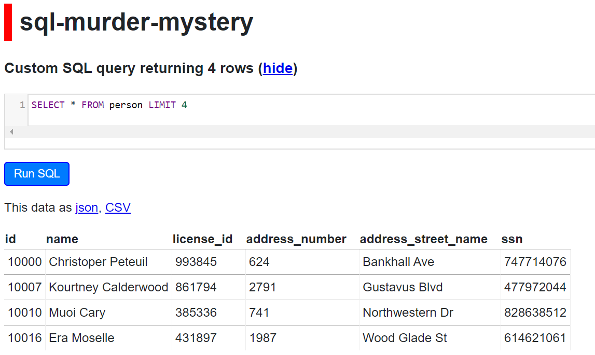
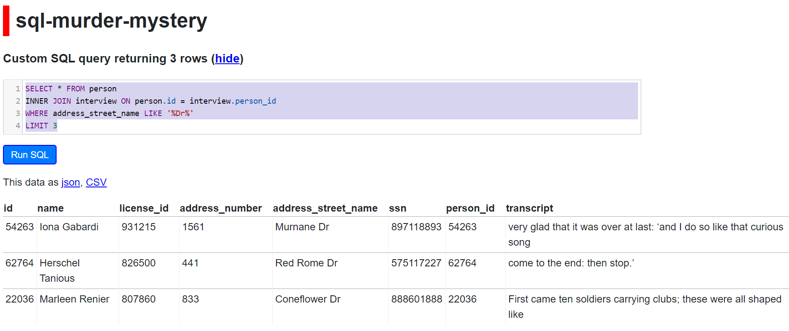

```{r, include = FALSE}
knitr::opts_chunk$set(
  collapse = TRUE,
  comment = "#>"
)
```

## Installation

You can install the development version from [GitHub](https://github.com/) with:

``` r
# install.packages("devtools")
devtools::install_github("sciencificity/reclues")
```

## Learn new skills while solving a mystery

The __`reclues`__ package mimics the SQL Murder Mystery done by [Northwestern's Knight Lab](https://github.com/NUKnightLab/sql-mysteries) - their game is set up to use `SQL` to solve the mystery, __`reclues`__ makes their data available in __`R`__ to solve the mystery using __`R`__ ;-). 

A brief of the task at hand is given in their [walkthrough](http://mystery.knightlab.com/walkthrough.html). Want to play the SQL version of the game online? [Here it is](https://sql-murder-mystery.datasette.io/sql-murder-mystery) courtesy of Simon Willison!

## Getting Started: The Prompt (@knightlab)
### Whodunnit??
A crime has taken place and the detective needs your help. The detective gave you the crime scene report,
but you somehow lost it. You vaguely remember that the crime was a murder that occurred sometime on
__Jan.15, 2018__ and that it took place in __SQL City__.
All the clues to this mystery are buried in a huge database (DB), and you need to use your R skills to navigate
through this vast network of information. Your first step to solving the mystery is to retrieve the corresponding
crime scene report from the police department's database. 

Take a look at the `cheatsheet` (the `Readme` file or this `Vignette`) to learn some tips on
how to do this using the tidyverse tools! From there, you can use your R skills to find the murderer.
The crime may be solved with other tools besides tidy tools, please feel free to use the datasets as a
learning tool for other packages in R or base R itself if that is your wish.

The data is available as __individual dataframes__:

* crime_scene_report
* drivers_license
* facebook_event_checkin
* get_fit_now_check_in
* get_fit_now_member
* income
* interview
* person

OR as the __full SQLite database__.

The cheatsheet is for tidyverse tools for now as a start, but since I am learning myself I may expand this to
include data.table etc. in future.
Have fun!

## The datasets
These 8 datasets will be available as soon as you install the package. Here is a brief description of what each dataset contains. Use ? combined with the dataset name to get the help page for the dataset (e.g. ?crime_scene_report).

|  Table Name|  Fields | Rows |
|:--:|:--|--:|
|  _crime_scene_report_| date, type, description, city| 1,228 rows|
|  _drivers_license_|  id, age, height, eye_color, hair_color, gender, plate_number, car_make, car_model| 10,007 rows|
|  _facebook_event_checkin_|  person_id, event_id, event_name, date| 20,011 rows|
|  _get_fit_now_check_in_|  membership_id, check_in_date, check_in_time, check_out_time| 2,703 rows|
|  _get_fit_now_member_|  id, person_id, name, membership_start_date, membership_status| 184 rows|
|  _income_|  ssn, annual_income| 7,514 rows|
|  _interview_|  person_id, transcript| 4,991 rows|
|  _person_|  id, name, license_id, address_number, address_street_name, ssn| 10,011 rows|

## SQLite DB
The raw SQLite database as per @knightlab is also available through the `get_db()` function. To use the SQLite DB for your investigation you will need the DBI package.

```{r, eval = FALSE}
install.packages("DBI")
```

----------

## Some useful functions to view the data 
### If you are using the dataframes `crime_scene_report`, `person` etc.

```{r view, warning=FALSE, message=FALSE}
library(reclues)
library(dplyr)
# see the first 6 observations
head(crime_scene_report)

# pivots data with column names (features) running down the page,
# and a few of the values of the data listed for each feature.
tibble::glimpse(drivers_license)

# Another nifty function is skimr::skim(dataset_name), the %>% is called a pipe
# and comes from the magrittr package. It essentially says take the dataset `get_fit_now_member`
# and sends it to the skimr::skim() function as the first input.
# Note how it tells you the number of "categories" in character data types - this can help understand
# which of your variables are categories vs free text strings - here membership_status 
# looks like a category, while id and name look like free text.
get_fit_now_member %>% skimr::skim()
```

#### SELECT
In R dplyr's `select()` works much the same as `SELECT` in SQL. You use it to get only specific columns you are interested in.

Let's say I wanted a closer look at the `name` and `license_id` of a person.

```{r select1}
# Let's have a look at a few columns of interest from the drivers_license table
person %>% 
  dplyr::select(name, license_id) %>% 
  head(3) %>% 
  # formattable func from the formattable package just prints a nice table in the Readme
  formattable::formattable()

```

SQL Equivalent is:

> SELECT name, license_id  
> FROM person   
> LIMIT 3   

Here's a snippet from the [online SQL version](https://sql-murder-mystery.datasette.io/sql-murder-mystery):

 


#### SELECT Helpers in `dplyr`
Or maybe I want the `car` related columns from the drivers_license table? `dplyr` has some handy helper functions that can assist us! By the way, I don't know of a SQL function that can give us this - if you do please drop me a line!

```{r select2}
# There are also helper functions to select columns of interest
# starts_with('start_text') will help select columns that begin with start_text
# ends_with('end_text') will help select columns that end with end_text
drivers_license %>% 
  # Maybe I am only interested in the columns describing the car...
  dplyr::select(starts_with('car')) %>% 
  head(3) %>% 
  # formattable just prints a nice table in the Readme
  formattable::formattable()
```

#### LIMIT
Let's say we wanted to see a part of the data - the head() function returns 6 observations and performs a similar functionality as the `LIMIT` keyword in SQL. 

* `head()` gives you the first 6 observations of the data in the "table"
* `tail()` gives you the last 6 observations of the data in the "table"

You can also specify a number as an argument to the `head()` or `tail()` functions. For example, `head(15)` and `tail(10)` will give you the first 15, and last 10 observations respectively. 

```{r limit1}
crime_scene_report %>% 
  dplyr::select(description) %>% 
  head(8) %>% 
  # formattable func from the formattable package just prints a nice table in the Readme
  formattable::formattable()
```

SQL Equivalent is: 

> `SELECT description FROM crime_scene_report LIMIT 8`

Here's a snippet from the [online SQL version](https://sql-murder-mystery.datasette.io/sql-murder-mystery):    

      

Maybe I am interested in having a look at all variables associated with a person but I just want to have a look at the data not bring back all 10,011 rows.

```{r limit2}
person %>% 
  head(4) %>% 
  formattable::formattable()
```

SQL Equivalent is:

> `SELECT * FROM person LIMIT 4;`

Here's a snippet from the [online SQL version](https://sql-murder-mystery.datasette.io/sql-murder-mystery):

 

#### DISTINCT
Let's say we wanted to see the different kinds of membership statuses.    
The `membership_status` field in the Get Fit Now Membership table seems to contain this info. We will use the `distinct` function from `dplyr`.

```{r explore, warning=FALSE, message=FALSE}
library(magrittr)

# T he magrittr package contains the pipe %>% function. Take the Get Fit Now membership data AND THEN
# give me the distinct values for the `membership_status` variable.
get_fit_now_member %>% 
    dplyr::distinct(membership_status) %>% 
    formattable::formattable()
```

SQL Equivalent is: 

> `SELECT DISTINCT(membership_status) FROM get_fit_now_member`

Here's a snippet from the [online SQL version](https://sql-murder-mystery.datasette.io/sql-murder-mystery):

 


#### COUNT DISTINCT
Let's say we were wondering which city has the highest number of crimes - here we want the city and a count of the times that city is mentioned in the crime scene report ...

```{r explore2}
crime_scene_report %>% 
    dplyr::count(city) %>% 
    dplyr::arrange(desc(n)) %>% 
    # filter to limit the print-out
    dplyr::filter(n >= 7) %>% 
    formattable::formattable()
```
Hhmmm looks like SQL City is quite notorious for crime!  

SQL Equivalent is:

> SELECT city, count(city) AS n  
> FROM crime_scene_report  
> GROUP BY city  
> ORDER BY n DESC  

Here's a snippet from the [online SQL version](https://sql-murder-mystery.datasette.io/sql-murder-mystery):

 


#### Magnify long pieces of text
Sometimes there are fields like `crime_scene_report.description` which are hard to see because the text runs over several lines. Even using View() or printing just the description to the screen sometimes does not help. 

Enter `pull()` from the __dplyr__ package which extracts a column from the data.   

Hint: You will need something like this to read some of the textual description and transcript information.

```{r}
crime_scene_report %>% 
  head(8) %>% 
  dplyr::pull(description) %>% 
  # these next 2 lines are just for displaying the result nicely in the Readme
  tibble::enframe(name = NULL) %>% 
  formattable::formattable()
```

```{r}
interview %>% 
  filter(stringr::str_length(transcript) >= 230) %>% 
  dplyr::pull(transcript) %>% 
  # these next 2 lines are just for displaying the result nicely in the Readme
  tibble::enframe(name = NULL) %>% 
  formattable::formattable()
```

#### LIKE
Let's say we're interested in finding the people that start with a __Z__. We will use the `stringr` package for this. The `str_detect()` function can be used in conjunction with regular expressions - here we looking for names that start with __`(^)`__ __Z__.

```{r like, warning=FALSE, message=FALSE}
library(stringr)
person %>% 
  dplyr::filter(stringr::str_detect(name, "^Z")) %>% 
  # Limit to top 5 for the print-out
  head(5) %>% 
  formattable::formattable()
```

SQL Equivalent is:

> SELECT * FROM person  
> WHERE name LIKE 'Z%'  

Here's a snippet from the [online SQL version](https://sql-murder-mystery.datasette.io/sql-murder-mystery):

 


#### JOINS

`dplyr` has joining functions such as `inner_join()`, `left_join()` etc. for joining one table to another. This mimics the `SQL` `INNER JOIN` etc.  
You will notice that the `person` table has a field called `id` and the `interview` table has a `person_id` field. Let's join these tables and see what we get.

```{r join}
person %>% 
  # Since the two tables have diff field names for the common field
  # we have to specify the `by` argument.
  # by = c('field_name_from_left_table' = 'field_name_from_right_table')
  dplyr::inner_join(interview, by = c('id' = 'person_id')) %>% 
  # Let's say we're only interested in interviews from people who live
  # on some Drive abbreviated to 'Dr'
  dplyr::filter(stringr::str_detect(address_street_name, 'Dr')) %>% 
  # Limit for print-out
  head(3) %>% 
  formattable::formattable()
```

> SELECT * FROM person    
> INNER JOIN interview ON person.id = interview.person_id  
> WHERE address_street_name LIKE '%Dr%'  
> LIMIT 3  

Here's a snippet from the [online SQL version](https://sql-murder-mystery.datasette.io/sql-murder-mystery):

 

---------

## Some useful funtions for DB Manipulation
### If you are using the SQLite DB

To work with the murder mystery SQLite database we'll first have to make a connection to it. The `DBI::dbConnect()` is usually used to set up the connection to the database, however in this package calling the `get_db()` function does the work for you. 
```{r db_interact1, warning=FALSE, message=FALSE}
library(DBI)
library(dbplyr)

# Retrieve a connection to the SQLite database embedded in this package
conn <- get_db()
```

We can list the tables of the database by using the the `DBI::dbListTables()` as below. It is basically saying "Hey, what tables are there in this database I've connected to?".

```{r list_tbls, warning=FALSE, message=FALSE}
# List the tables in the database
DBI::dbListTables(conn)
```

We may connect through the connection we created to get an idea of what any one of the tables contains. Here we look at the `crime_scene_report` table. The function below says "What's the crime_scene_report table like? Show me the first few rows, please."

SQL Equivalent is:

> `SELECT * FROM crime_scene_report LIMIT 10;`

```{r glimpse_data, warning=FALSE, message=FALSE}
# Let's glimpse the data in crime_scene_report table 
dplyr::tbl(conn, "crime_scene_report")
```

Notice how the rows are marked as `??` in the output `table<crime_scene_report> [?? x 4]`. The source is a SQLite database and it just returns a taste of the data and does not bring the entire table back into R, hence it has no idea how many rows there are in the crime_scene_report table embedded in the sql-murder-mystery database.

In an R Markdown file you can use the connection to directly bring back data like writing a SQL Query at an SQL editor using the ```{sql, connection = conn} ``` code block - please remove the "" around the code block if running in a markdown file.
  
    "```{sql, connection = conn}  
    SELECT * FROM person LIMIT 3  
    ```" 

```{sql, connection = conn}
-- Direct SQL on the DB through the connection
SELECT * 
FROM person
LIMIT 3
```

### dbplyr
#### show_query() to Learn SQL!

`dbplyr` helps take dplyr code and convert it into SQL queries which then get run on the database you connected to. Here we'll have a look at a few of the commands. The `show_query()` function from dplyr allows you to see the generated SQL - this is a _**handy way to learn SQL**_ as well!

Also check out the [documentation](https://www.rdocumentation.org/packages/dbplyr/versions/1.4.2) and [vignette](https://cran.r-project.org/web/packages/dbplyr/vignettes/dbplyr.html) of dbplyr to learn more.
```{r}
tbl(conn, "crime_scene_report") %>% 
  filter(type == "murder") %>% 
  show_query()

tbl(conn, "drivers_license") %>% 
  count(eye_color) %>% 
  show_query()
```

#### Execute query on a database - but use dplyr like coding!

```{r}
tbl(conn, "crime_scene_report") %>% 
  filter(type == "murder") 

tbl(conn, "drivers_license") %>% 
  count(eye_color) 
```

#### Like 
We can use the `%LIKE%` functionality here to get data. Let's say we're looking for an individual named "Zelda" ...

```{r}
tbl(conn, "person") %>% 
  filter(name %LIKE% 'Zel%')

#> <SQL>
#> SELECT *
#> FROM `person`
#> WHERE (`name` LIKE 'Zel%')
```


---------

## Think you solved it
Run the following commands in R once you think you've solved the problem. You will need the DBI package and if you've been using the datasets to solve the mystery and not the SQLite database (i.e. the individual dataframes of `person`, `drivers_license` etc.) then uncomment the first line to make a connection to the database, run the queries below after you've put in the culprit you suspect, and then disconnect from the database. 
```{r, eval = FALSE}
conn <- reclues::get_db()

# Replace 'Insert the name of the person you found here' with the name of the individual you found.
DBI::dbExecute(conn, "INSERT INTO solution VALUES (1, 'Insert the name of the person you found here')")

# Did we solve it? You'll either get a "That's not the right person." or a "Congrats,..." message.
DBI::dbGetQuery(conn, "SELECT value FROM solution;")

DBI::dbDisconnect(conn)
```

----------

## Resources

### SQL

* Brandon Rohrer (@_brohrer_) has a curated list of resources [here](https://end-to-end-machine-learning.teachable.com/courses/667372/lectures/11900584)

### R

* Hadley Wickham and Garrett Grolemund's book [R for Data Science](https://r4ds.had.co.nz/)
* [dplyr cheatsheet](https://resources.rstudio.com/the-essentials-of-data-science/data-transformation)
* [dplyr video](https://resources.rstudio.com/the-essentials-of-data-science/the-grammar-and-graphics-of-data-science-58-51) and another [here](https://resources.rstudio.com/the-essentials-of-data-science/data-wrangling-with-r-and-rstudio-55-40)
* [stringr](https://stringr.tidyverse.org/articles/stringr.html)
* [Primers](https://rstudio.cloud/learn/primers)
* [RStudio Education](https://education.rstudio.com/)
* [Jumpstart with R](https://university.business-science.io/p/jumpstart-with-r)
* [Cheatsheets](https://rstudio.com/resources/cheatsheets/)
* [Loads of other resources](https://github.com/Chris-Engelhardt/data_sci_guide)
* For [DB](https://cran.r-project.org/web/packages/dbplyr/vignettes/dbplyr.html) interaction via R using dbplyr.
